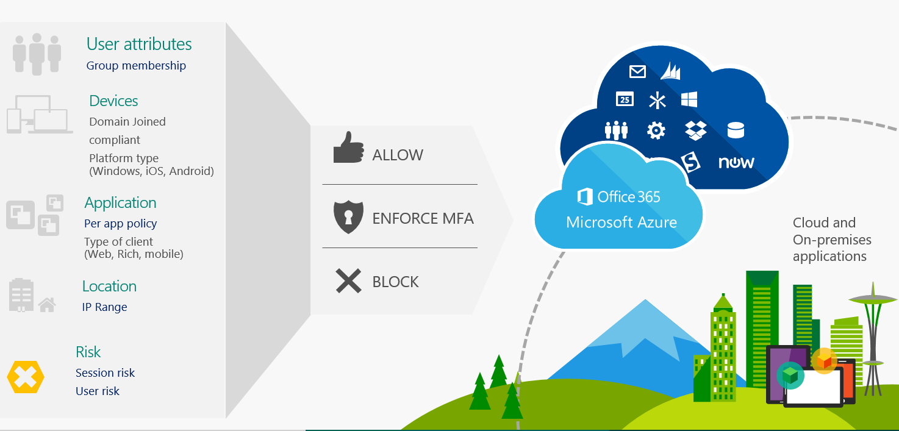

> [!VIDEO https://www.microsoft.com/videoplayer/embed/RE2Ys0Y]

Identity & access management is the bedrock upon which a secure digital estate is built. The credentials that you issue to your users identify them to Microsoft 365 and when combined with strong authentication methods, like multi-factor authentication, they can be taken as proof positive that the person using them is who they claim to be. Once their identity is established (called authentication), the user is permitted access (called authorization) to the resources that you have previously granted them permissions to.

## Secure authentication
Helping secure your users helps protect against breaches. And one important area is the quality of user passwords. Passwords are problematic. Users are expected to remember complex passwords for a variety of different accounts, both personal and for work. Issues with passwords include:

- Strong passwords can be difficult to remember
- Users often reuse passwords on multiple different sites
- Server breaches can expose symmetric network credentials (passwords).
- Passwords are subject to replay attacks.
- Users can inadvertently expose their passwords due to phishing attacks. 

This poses a significant security risk as once bad actors get compromised passwords, they can sign into multiple sites. Most breaches are a result of compromised passwords. What if we could remove passwords altogether? Microsoft 365 security solutions include password replacement options to help reduce risk.

**Windows Hello**. In Windows 10, Windows Hello for Business replaces passwords with strong two-factor authentication on PCs and mobile devices - a new type of user credential that's tied to a device and uses a biometric or PIN. Windows Hello for Business lets users authenticate to an Active Directory or Azure Active Directory account. 

**Microsoft Authenticator**. The Microsoft Authenticator app helps you keep your accounts more secure, especially while viewing sensitive information. 

You can use the Microsoft Authenticator app in multiple ways, including:
- **Two-factor verification**. The standard verification method, where one of the factors is your password. After you sign in to a device, app, or site using your username and password, you can use Microsoft Authenticator to approve a notification or enter a provided verification code.
- **Phone sign-in**. A version of two-factor verification that lets you sign in without requiring a password, using your username and your mobile device with your fingerprint, face, or PIN.

## Conditional Access
Conditional Access provides granular access to keep your corporate data secure, while letting users do their best work from any device and from any location. Conditional Access helps protect sensitive data by evaluating users, devices, apps, location, and risk before granting access to corporate data. This helps ensure that only approved users and devices can access critical company resources. 

Conditional Access spans Microsoft 365 services including Intune, Microsoft 365, and Windows 10. 

*Conditional Access evaluates each access request on a number of different criteria and then using policies you define, decides if it should be allowed, if stricter controls are needed or if the access attempt should be blocked altogether*

## Identity protection
Most security breaches are a result of attackers stealing a user’s identity. Over the years, attackers have become increasingly effective in using third-party breaches and using sophisticated phishing attacks. As soon as an attacker gains access to even low privileged user accounts, it's relatively easy for them to gain access to important company resources. 

To help protect your user’s identities, you need to: 
- Protect all identities regardless of their privilege level
- Proactively prevent compromised identities from being abused

Protect identities in your Microsoft 365 environment with:
- **Azure AD Identity Protection**. User accounts are critical to helping identify users, so you need to be able to identify unusual account behavior. This helps you identify attempts to compromise accounts, possibly by a hacker or other malicious person. When Azure AD Identity Protection detects unusual account behavior, it can block account access, or perhaps require additional authentication options. 
- **Microsoft Cloud app security**. Analytics for your cloud apps and services, helping security teams better understand the protections for critical data across cloud apps.
- **Azure Advanced Threat Protection (ATP)**. A cloud-based security solution that identifies, detects, and helps you investigate advanced threats, compromised identities, and malicious insider actions directed at your organization.
- **Windows 10**. Built-in identity protection capabilities help protect user identities. For example, Windows Hello, a biometric authentication feature that helps strengthen authentication and guard against potential spoofing by using fingerprint matching and facial recognition, is built right into the OS.
